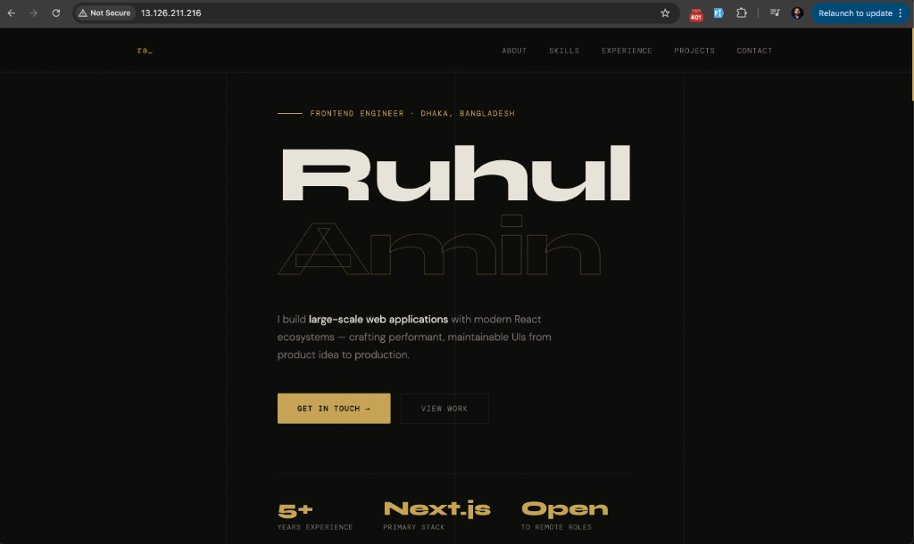

<div align="center">

# 🔒 Nginx Web Server

### HTTPS · SSL · Reverse Proxy

[](https://nginx.org/)
[](https://www.openssl.org/)
[](https://ubuntu.com/)
[](https://letsencrypt.org/)

<br/>

> **Production-ready Nginx configuration** with SSL termination, reverse proxy,
> caching headers, and security hardening — deployed on AWS EC2.

</div>

<br/>

---

## 📋 Table of Contents

- [Part 1 — Basic Setup](#-part-1--basic-setup)
- [Part 2 — SSL & HTTPS](#-part-2--ssl--https)
- [Part 3 — Nginx Config Hardening](#-part-3--nginx-config-hardening)
- [Part 4 — Reverse Proxy](#-part-4--reverse-proxy)
- [Part 5 — Testing & Validation](#-part-5--testing--validation)

---

## ✅ Part 1 — Basic Setup

### 1. Install Nginx & Dependencies

```bash
sudo apt update && apt upgrade -y
sudo apt install -y nginx openssl certbot python3-certbot-nginx
sudo systemctl enable nginx
sudo systemctl status nginx
```

### 2. Create Web Directory & Set Permissions

```bash
sudo mkdir -p /var/www/secure-app
sudo chown -R ubuntu:www-data /var/www/secure-app
```

### 3. Deploy the HTML Page

Cloned portfolio into `/var/www/secure-app`:

```bash
sudo chown -R ubuntu:www-data /var/www/secure-app/portfolio.html
```

<div align="center">

#### 📸 Live Preview



<sub>Portfolio site served over HTTP at <code>13.126.211.216</code></sub>

</div>

<br/>

### 4. Configure Nginx

```bash
sudo nano /etc/nginx/sites-available/secure-app
sudo ln -s /etc/nginx/sites-available/secure-app /etc/nginx/sites-enabled/
sudo nginx -t
sudo systemctl reload nginx
```

### 5. Nginx Server Block

<details>
<summary>📄 <code>/etc/nginx/sites-available/secure-app</code></summary>

<br/>

```nginx
server {
    listen 80;
    listen [::]:80;
    server_name 13.126.211.216;
    root /var/www/secure-app;
    index index.html index.htm;

    access_log /var/log/nginx/secure-app-access.log;
    error_log  /var/log/nginx/secure-app-error.log warn;

    location / {
        try_files $uri $uri/ =404;
    }

    location ~* \.(css|js|jpg|jpeg|png|gif|ico|svg|woff|woff2)$ {
        expires 30d;
        add_header Cache-Control "public, no-transform";
    }

    location ~ /\. {
        deny all;
    }
}
```

</details>

<br/>

#### ⚙️ Config Highlights

| Directive | Purpose |
|---|---|
| `try_files $uri $uri/ =404` | Serves files or returns 404 |
| `expires 30d` | Caches static assets for 30 days |
| `Cache-Control: public` | Allows CDN / browser caching |
| `deny all` on `/\.` | Blocks access to hidden files (`.env`, `.git`) |

---

## 🔐 Part 2 — SSL & HTTPS

> 🚧 *Coming soon — Certbot, Let's Encrypt, and HTTPS redirect configuration.*

---

## 🛡️ Part 3 — Nginx Config Hardening

> 🚧 *Coming soon — Security headers, rate limiting, and gzip compression.*

---

## 🔄 Part 4 — Reverse Proxy

> 🚧 *Coming soon — Proxying requests to a backend application server.*

---

## 🧪 Part 5 — Testing & Validation

> 🚧 *Coming soon — curl tests, SSL Labs score, and load testing.*

---

<div align="center">

### 🗺️ Roadmap

```
 ✅ Basic Setup
 ─────────────▶ 🔐 SSL
                 ─────────────▶ 🛡️ Hardening
                                 ─────────────▶ 🔄 Reverse Proxy
                                                 ─────────────▶ 🧪 Testing
```

<br/>

**Built with ❤️ while learning DevOps**

</div>