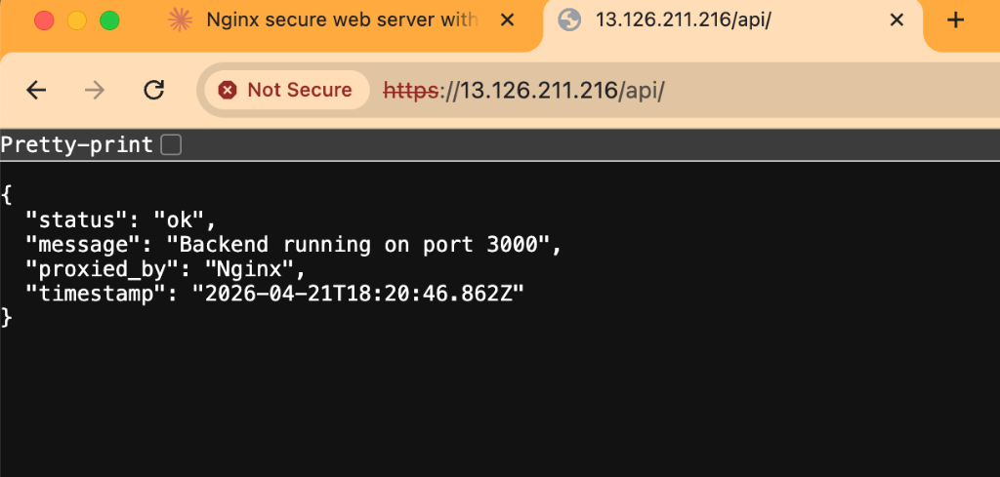
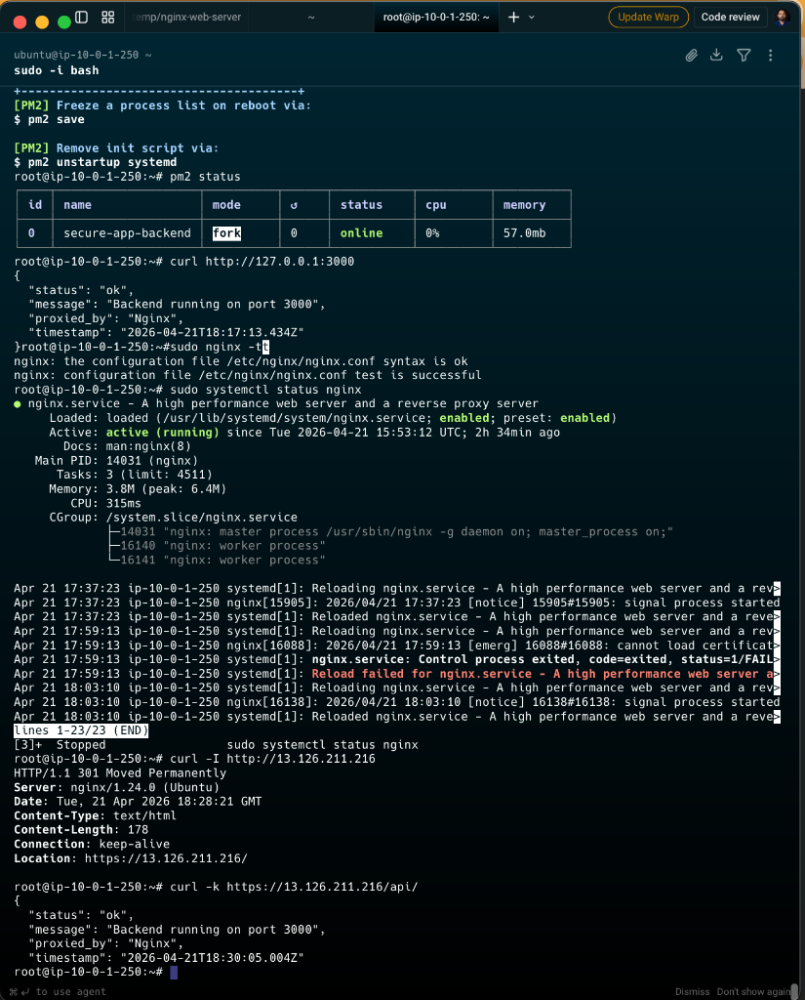

<div align="center">

# 🔒 Nginx Web Server

### HTTPS · SSL · Reverse Proxy

[](https://nginx.org/)
[](https://www.openssl.org/)
[](https://ubuntu.com/)
[](https://letsencrypt.org/)

<br/>

> **Production-ready Nginx configuration** with SSL termination, reverse proxy,
> caching headers, and security hardening — deployed on AWS EC2.

</div>

<br/>

---

## 📋 Table of Contents

- [Part 1 — Basic Setup](#-part-1--basic-setup)
- [Part 2 — SSL & HTTPS](#-part-2--ssl--https)
- [Part 3 — Nginx Configuration](#-part-3--nginx-configuration)
- [Part 4 — Reverse Proxy](#-part-4--reverse-proxy)
- [Part 5 — Testing & Validation](#-part-5--testing--validation)

---

## ✅ Part 1 — Basic Setup

### 1. Install Nginx & Dependencies

```bash
sudo apt update && apt upgrade -y
sudo apt install -y nginx openssl certbot python3-certbot-nginx
sudo systemctl enable nginx
sudo systemctl status nginx
```

### 2. Create Web Directory & Set Permissions

```bash
sudo mkdir -p /var/www/secure-app
sudo chown -R ubuntu:www-data /var/www/secure-app
```

### 3. Deploy the HTML Page

Cloned portfolio into `/var/www/secure-app`:

```bash
sudo chown -R ubuntu:www-data /var/www/secure-app/portfolio.html
```


### 4. Configure Nginx

```bash
sudo nano /etc/nginx/sites-available/secure-app
sudo ln -s /etc/nginx/sites-available/secure-app /etc/nginx/sites-enabled/
sudo nginx -t
sudo systemctl reload nginx
```

### 5. Nginx Server Block

<details>
<summary>📄 <code>/etc/nginx/sites-available/secure-app</code></summary>

<br/>

```nginx
server {
    listen 80;
    listen [::]:80;
    server_name 13.126.211.216;
    root /var/www/secure-app;
    index index.html index.htm;

    access_log /var/log/nginx/secure-app-access.log;
    error_log  /var/log/nginx/secure-app-error.log warn;

    location / {
        try_files $uri $uri/ =404;
    }

    location ~* \.(css|js|jpg|jpeg|png|gif|ico|svg|woff|woff2)$ {
        expires 30d;
        add_header Cache-Control "public, no-transform";
    }

    location ~ /\. {
        deny all;
    }
}
```

</details>

<br/>

#### ⚙️ Config Highlights

| Directive | Purpose |
|---|---|
| `try_files $uri $uri/ =404` | Serves files or returns 404 |
| `expires 30d` | Caches static assets for 30 days |
| `Cache-Control: public` | Allows CDN / browser caching |
| `deny all` on `/\.` | Blocks access to hidden files (`.env`, `.git`) |

<div align="center">

#### 📸 Live Preview


<sub>Portfolio site served over HTTP at <code>13.126.211.216</code></sub>

</div>

---

## ✅ Part 2 — SSL & HTTPS

### 1. Create SSL Directory

```bash
sudo mkdir -p /etc/nginx/ssl
```

### 2. Generate Self-Signed Certificate

> 365-day validity · RSA 4096-bit key

```bash
sudo openssl req -x509 -nodes -days 365 -newkey rsa:4096 \
  -keyout /etc/nginx/ssl/self-signed.key \
  -out /etc/nginx/ssl/self-signed.crt \
  -subj "/C=BD/ST=Dhaka/L=Dhaka/O=secure-app/CN=13.126.211.216"
```

### 3. Verify

```bash
ls -la /etc/nginx/ssl/
```

**Expected output:**

```
/etc/nginx/ssl/self-signed.crt
/etc/nginx/ssl/self-signed.key
```

#### 🔑 Certificate Details

| Field | Value |
|---|---|
| Type | Self-signed X.509 |
| Key Size | RSA 4096-bit |
| Validity | 365 days |
| Country | BD |
| State / City | Dhaka |
| Organization | secure-app |
| Common Name | `13.126.211.216` |

---

## ✅ Part 3 — Nginx Configuration

### 1. Create Config File

```bash
sudo nano /etc/nginx/sites-available/secure-app
```

### 2. Nginx Config (Full)

<details>
<summary>📄 <code>/etc/nginx/sites-available/secure-app</code></summary>

<br/>

```nginx
# ── HTTP → HTTPS Redirect (Port 80) ──────────────────────────
server {
    listen 80;
    listen [::]:80;
    server_name 13.126.211.216;

    return 301 https://$host$request_uri;
}

# ── HTTPS Server (Port 443) ───────────────────────────────────
server {
    listen 443 ssl;
    listen [::]:443 ssl;
    server_name 13.126.211.216;

    # SSL Certificate
    ssl_certificate     /etc/nginx/ssl/self-signed.crt;
    ssl_certificate_key /etc/nginx/ssl/self-signed.key;

    # SSL Hardening
    ssl_protocols             TLSv1.2 TLSv1.3;
    ssl_ciphers               HIGH:!aNULL:!MD5;
    ssl_prefer_server_ciphers on;

    # Static site root
    root  /var/www/secure-app;
    index index.html;

    location / {
        try_files $uri $uri/ =404;
    }

    # Reverse Proxy → Backend on port 3000
    location /api/ {
        proxy_pass         http://127.0.0.1:3000/;
        proxy_http_version 1.1;
        proxy_set_header   Host              $host;
        proxy_set_header   X-Real-IP         $remote_addr;
        proxy_set_header   X-Forwarded-For   $proxy_add_x_forwarded_for;
        proxy_set_header   X-Forwarded-Proto $scheme;
    }

    # Security Headers
    add_header X-Frame-Options        "SAMEORIGIN"  always;
    add_header X-Content-Type-Options "nosniff"     always;
    add_header Strict-Transport-Security "max-age=31536000" always;

    access_log /var/log/nginx/secure-app.access.log;
    error_log  /var/log/nginx/secure-app.error.log;
}
```

</details>

<br/>

#### ⚙️ Config Highlights

| Feature | Details |
|---|---|
| HTTP → HTTPS | `return 301` redirects all port 80 traffic |
| SSL Protocols | TLSv1.2 & TLSv1.3 only |
| Ciphers | `HIGH:!aNULL:!MD5` — strong ciphers only |
| Reverse Proxy | `/api/` → `127.0.0.1:3000` |
| `X-Frame-Options` | Prevents clickjacking (`SAMEORIGIN`) |
| `X-Content-Type-Options` | Prevents MIME-type sniffing (`nosniff`) |
| `HSTS` | Forces HTTPS for 1 year (`max-age=31536000`) |

### 3. Enable Site & Disable Default

```bash
sudo ln -sf /etc/nginx/sites-available/secure-app \
             /etc/nginx/sites-enabled/secure-app

sudo rm -f /etc/nginx/sites-enabled/default
```

### 4. Test & Reload

```bash
sudo nginx -t
sudo systemctl reload nginx
```

---

## ✅ Part 4 — Reverse Proxy

> Backend on Port 3000 · Proxied via Nginx `/api/`

### 1. Create Node.js Backend

```bash
sudo nano /var/www/secure-app/server.js
```

<details>
<summary>📄 <code>/var/www/secure-app/server.js</code></summary>

<br/>

```javascript
const http = require('http');

const server = http.createServer((req, res) => {
  res.setHeader('Content-Type', 'application/json');
  res.writeHead(200);
  res.end(JSON.stringify({
    status:    'ok',
    message:   'Backend running on port 3000',
    proxied_by: 'Nginx',
    timestamp: new Date().toISOString()
  }, null, 2));
});

server.listen(3000, '127.0.0.1', () => {
  console.log('Backend running at http://127.0.0.1:3000');
});
```

</details>

<br/>

### 2. Install PM2 & Run Backend

```bash
sudo npm install -g pm2
pm2 start /var/www/secure-app/server.js --name "secure-app-backend"
pm2 save
pm2 startup
```

#### 🔧 PM2 Quick Reference

| Command | Purpose |
|---|---|
| `pm2 list` | Show all running processes |
| `pm2 logs secure-app-backend` | View backend logs |
| `pm2 restart secure-app-backend` | Restart the backend |
| `pm2 stop secure-app-backend` | Stop the backend |
| `pm2 save` | Persist process list across reboots |
| `pm2 startup` | Generate system startup script |

### 3. Verify Backend is Listening

```bash
curl http://127.0.0.1:3000
```

**Expected response:**

```json
{
  "status": "ok",
  "message": "Backend running on port 3000",
  "proxied_by": "Nginx",
  "timestamp": "2025-04-21T18:00:00.000Z"
}
```

<div align="center">

#### 📸 Live Preview



<sub>API response at <code>https://13.126.211.216/api/</code> — proxied through Nginx to port 3000</sub>

</div>

---

## ✅ Part 5 — Testing & Validation

### Test 1 · Nginx Config Syntax Check

```bash
sudo nginx -t
```

**Expected:**

```
nginx: the configuration file /etc/nginx/nginx.conf syntax is ok
nginx: configuration file /etc/nginx/nginx.conf test is successful
```

---

### Test 2 · Reload Nginx

```bash
sudo systemctl reload nginx
sudo systemctl status nginx
```

---

### Test 3 · HTTP → HTTPS Redirect

```bash
curl -I http://13.126.211.216
```

**Expected:**

```
HTTP/1.1 301 Moved Permanently
Location: https://13.126.211.216/
```

---

### Test 4 · HTTPS Working (Self-Signed)

```bash
curl -k -I https://13.126.211.216
```

**Expected:**

```
HTTP/2 200
server: nginx
content-type: text/html
```

---

### Test 5 · Backend via Nginx Reverse Proxy

```bash
curl -k https://13.126.211.216/api/
```

**Expected:**

```json
{
  "status": "ok",
  "message": "Backend running on port 3000",
  "proxied_by": "Nginx",
  "timestamp": "2025-04-21T10:00:00.000Z"
}
```

---

#### 📊 Test Summary

| # | Test | Command | Expected Status |
|---|---|---|---|
| 1 | Config syntax | `nginx -t` | ✅ `syntax is ok` |
| 2 | Service reload | `systemctl reload nginx` | ✅ `active (running)` |
| 3 | HTTP → HTTPS | `curl -I http://...` | ✅ `301 Moved Permanently` |
| 4 | HTTPS response | `curl -k -I https://...` | ✅ `HTTP/2 200` |
| 5 | Reverse proxy | `curl -k https://.../api/` | ✅ `JSON response` |

<div align="center">

#### 📸 Terminal Output



<sub>All tests passing — Nginx config valid, HTTPS active, reverse proxy working</sub>

</div>

---

<div align="center">

### 🗺️ Roadmap

```
 ✅ Basic Setup
 ─────────────▶ ✅ SSL
                 ─────────────▶ ✅ Nginx Config
                                 ─────────────▶ ✅ Reverse Proxy
                                                 ─────────────▶ ✅ Testing
```

<br/>

**Built with ❤️ while learning DevOps**

</div>